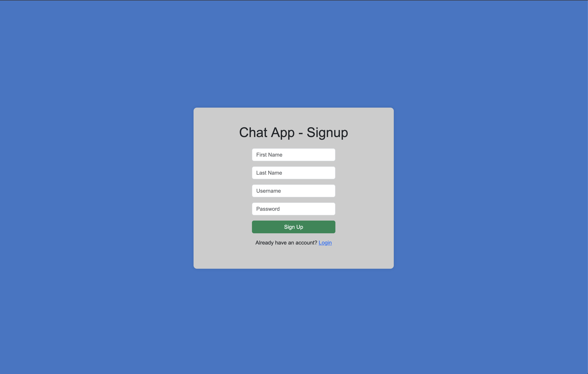
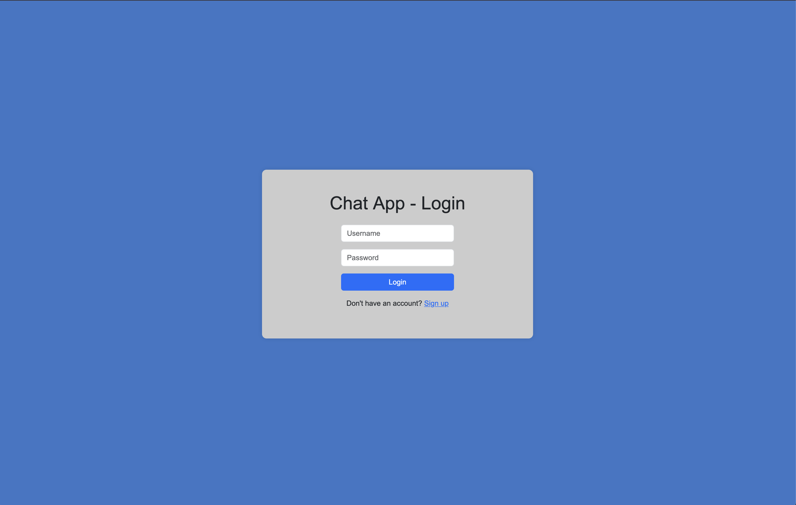
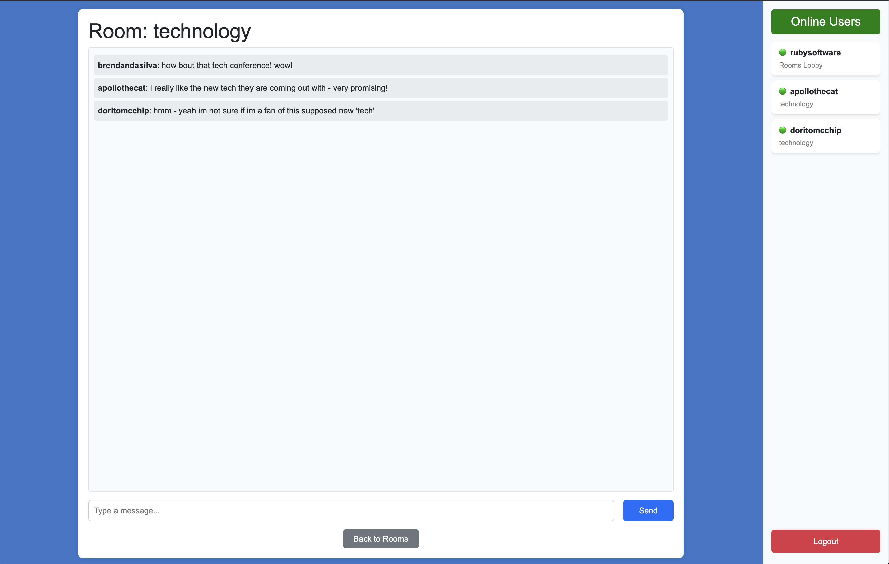
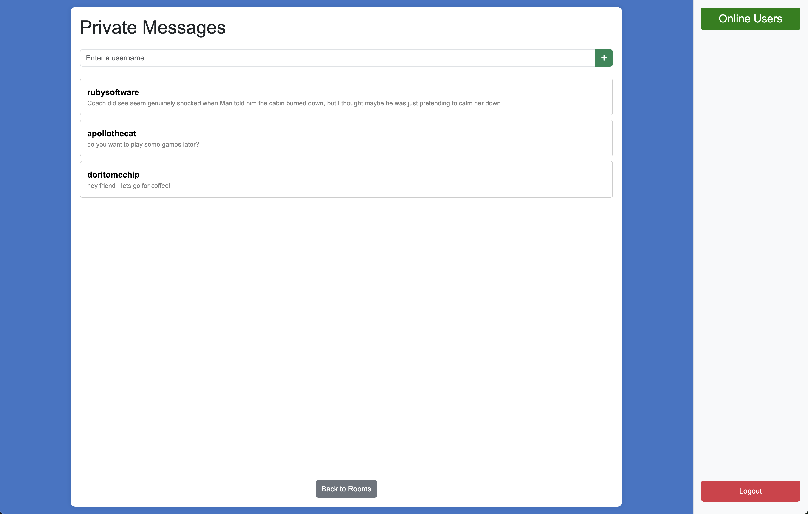
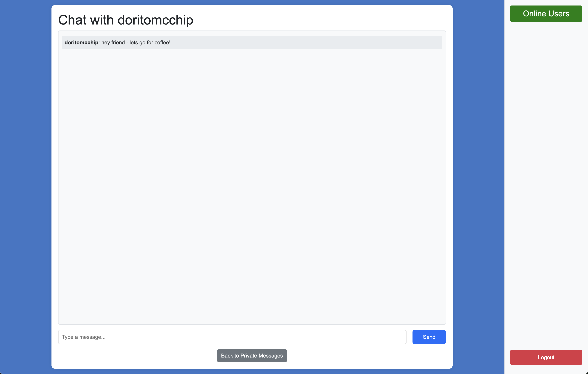

# **Real-Time Chat Application**

## **Overview**

This is a **real-time chat application** built using **Node.js**, **Express.js**, **MongoDB**, and **Socket.io**, with **Bootstrap** for styling. Users can sign up, log in, and join different chat rooms for public discussions or private one-on-one conversations. The app features real-time messaging, online user tracking, private messaging, and a **typing indicator**.

This was originally a 12-hour lab test for Full Stack Dev II, but I decided to further build it out afterwards as a mini personal project to include in my portfolio.

**_First Pass_**
You can view a quick walkthrough of the **first pass** here: https://youtu.be/wrBkJihn8Zo

**_Second Pass_**
You can view a **quick walkthrough** of the application here:  
📹 _[Insert Video Link Here]_

## **Screenshots**

Below are some previews of the application:

- **Sign Up Page**  
  

- **Login Page**  
  

- **Rooms Lobby**  
  

- **Group Chat**  
  

- **Private Messages**
  

- **Private Chat**
  

---

## **Features**

### **User Authentication**

- Secure **sign-up and login** with **bcrypt.js** password hashing.
- **Session-based authentication** using `sessionStorage`.

### **Real-Time Messaging**

- **Instant chat updates** with **Socket.io**.
- **Public group chat rooms** with message history.
- **Private one-on-one messaging**, with **message history retrieval**.

### **Chat Rooms**

- Users can join **various themed chat rooms**, including:
  - **Sports**
  - **Technology**
  - **Movies**
  - **Gaming**
  - **Random**
  - **Music**
  - **News**
  - **Health**
  - **Travel**
  - **Food**
  - **Fitness**
  - **Education**
  - **Business**
- Each **room has its own chat history** stored in MongoDB.

### **Private Messaging**

- Users can start **one-on-one conversations**.
- **Previous conversations are saved** and accessible from the private messages list.
- New **messages appear instantly**, with **notifications** for unread messages.

### **Online Users List**

- Displays **active users**, their **current room**, and **green online indicators**.
- Users **cannot see themselves** in the list to avoid redundancy.

### **Typing Indicator**

- Shows **who is typing** in real time.
- The indicator **disappears** when the user stops typing.

### **Dynamic UI & Responsiveness**

- **Grid layout for chat rooms**, adjusting based on screen size.
- **Mobile-responsive hamburger menu** for the online users list.
- **Chat messages alternate positions** (incoming on the left, outgoing on the right).

---

## **Installation & Setup**

### **Prerequisites**

- [**Node.js**](https://nodejs.org/) (Ensure it’s installed)
- **MongoDB** (Local or [MongoDB Atlas](https://www.mongodb.com/atlas/database))

### **Setup Steps**

1. **Clone this repository:**
   ```sh
   git clone https://github.com/BrendanDasilva/chat-app.git
   cd chat-app
   ```

### **2️⃣ Install Dependencies**

```sh
npm install
```

### **3️⃣ Configure Environment Variables**

Create a `.env` file in the root directory and add the following:

```plaintext
PORT=3000
MONGO_URI=mongodb+srv://<your_username>:<your_password>@cluster0.mongodb.net/your_database?retryWrites=true&w=majority
```

Replace placeholders with your actual **MongoDB credentials** and **JWT secret**.

### **4️⃣ Start the Server**

```sh
node server.js
```

## 📂 Project Structure

```
chat-app/
│-- config/
│ ├── db.js # Database connection setup
│-- models/
│ ├── User.js # User schema
│ ├── GroupMessage.js # Group message schema
│ ├── PrivateMessage.js # Private message schema
│-- public/
│ ├── styles.css # CSS styles
│ ├── script.js # Frontend JavaScript
│-- views/
│ ├── login.html # Login page
│ ├── signup.html # Signup page
│ ├── rooms.html # Room selection page
│ ├── chat.html # Group chat page
│ ├── chat_private.html # Private chat page
│ ├── private_messages.html # Private messages list
│-- server.js # Main Express server
│-- package.json # Dependencies
```

---

## 🛠 **Tech Stack**

- **Backend**: Node.js, Express.js, MongoDB, Mongoose, bcrypt.js, dotenv
- **Frontend**: HTML, CSS (Bootstrap), JavaScript
- **Database**: MongoDB (Atlas) & Mongoose
- **Real-Time Communication**: Socket.io

---

## 👨‍💻 **Author**

**Brendan Dasilva**

---
